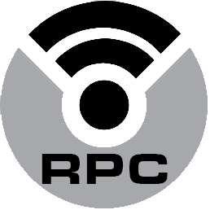
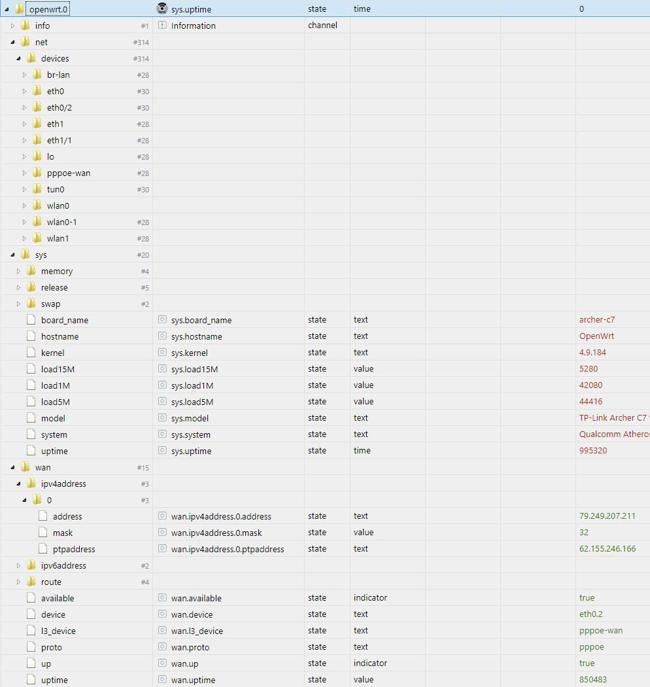

# ioBroker.openwrt  V0.0.3 seems broken, do not update

[](https://www.npmjs.com/package/iobroker.openwrt)
[](https://www.npmjs.com/package/iobroker.openwrt)


[](https://david-dm.org/Schnup89/iobroker.openwrt)
[](https://snyk.io/test/github/Schnup89/ioBroker.openwrt)

[](https://nodei.co/npm/iobroker.openwrt/)

**Tests:**: [](https://travis-ci.org/Schnup89/ioBroker.openwrt)


This Adapter interacts with the OpenWrt RPC API of a OpenWrt-Device (Router, Switch, AccessPoint, RaspberryPI, etc.).

**Reading data from ubus to ioBroker-Objects:** 
At the moment only the "ubus call" results are fetched. With that commands you should get the most data out of the router. 
The json-results are parsed and written to the objects database, <a href="https://openwrt.org/docs/techref/ubus">see here [ubus]</a>

**Setting data with ubus from ioBroker to OpenWrt:**
You can send Commands to the router over the API with the State-Object "sendCommand".  
Put in the command you want to send to the router, the result will be written as JSON-Object to the "sendCommandLastResult" Object and the "sendCommand"-Object will be cleared.


### ToDo / new Features
- ToDo: Initial Testing
- ToDo: Dynamic Objects, see https://forum.iobroker.net/topic/32465/dynamischer-objektbaum (german)
- Feature: Interface Handling (get Informations automaticly)


## Setup and Check API on Target-Device
### Setup
To enable the API, install the following package and restart `uhttpd`:

```bash
opkg install luci-mod-rpc
/etc/init.d/uhttpd restart
```

Source: [HowTo at the official OpenWrt-Github-Repo](https://github.com/openwrt/luci/wiki/JsonRpcHowTo)

### Check
To check that the API ist working fine, just navigate to this url with your webbrowser:
```bash
http://[TargetDeviceIPorHostname]/cgi-bin/luci/rpc/auth
```

If you get something like this, the API is successfully installed:

```bash
{"id":null,"error":{"message":"Parse error.","code":-32700},"jsonrpc":"2.0"}
```
> Side-Note: The URL-Check on the "admin"-Page checks for "jsonrpc" text in response


## Usage
- Type the URL, Username and Password (same as the SSH/Webinterface) in the admin page

- If everything works fine, you will see the new Objects:



- Get more Data with specific ubus call-commands, [check this out](https://github.com/Schnup89/ioBroker.openwrt/wiki/ubus-commands)


## Troubleshooting
If there is something wrong, you can check the communication at the admin-panel.

First the URL should be "OK", test it with the "Check URL"-Button.

Second the Authentication with user/pass can be tested with the "Check Auth"-Button.

If there are some error's the button will get red, look at the ioBroker-Logs for more informations .


## Changelog

### 0.0.3
* (Schnup89) Merged PR15, Thanks to "TyrionWarMage", New Parameter "Alias" and "isAvailable"

### 0.0.2
* (Schnup89) Merged PR13, Thanks to "TyrionWarMage", Parameter "Last Updated" is now set to the states

### 0.0.1
* (Schnup89) initial release


## License
MIT License

Copyright (c) 2020 Schnup89 <tobias_tsafi@gmx.de>

Permission is hereby granted, free of charge, to any person obtaining a copy
of this software and associated documentation files (the "Software"), to deal
in the Software without restriction, including without limitation the rights
to use, copy, modify, merge, publish, distribute, sublicense, and/or sell
copies of the Software, and to permit persons to whom the Software is
furnished to do so, subject to the following conditions:

The above copyright notice and this permission notice shall be included in all
copies or substantial portions of the Software.

THE SOFTWARE IS PROVIDED "AS IS", WITHOUT WARRANTY OF ANY KIND, EXPRESS OR
IMPLIED, INCLUDING BUT NOT LIMITED TO THE WARRANTIES OF MERCHANTABILITY,
FITNESS FOR A PARTICULAR PURPOSE AND NONINFRINGEMENT. IN NO EVENT SHALL THE
AUTHORS OR COPYRIGHT HOLDERS BE LIABLE FOR ANY CLAIM, DAMAGES OR OTHER
LIABILITY, WHETHER IN AN ACTION OF CONTRACT, TORT OR OTHERWISE, ARISING FROM,
OUT OF OR IN CONNECTION WITH THE SOFTWARE OR THE USE OR OTHER DEALINGS IN THE
SOFTWARE.
